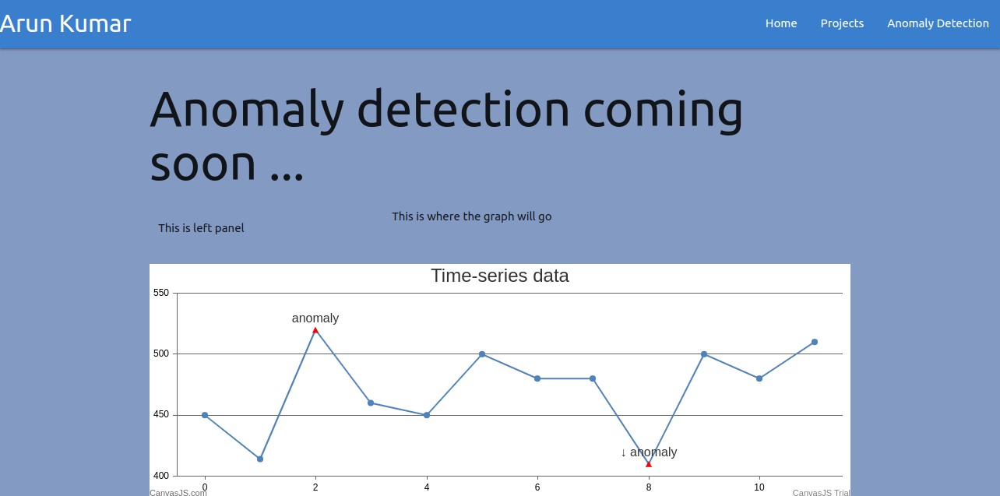

Hi there! In this prac, I use MVC paradigm to organize my code in a more manageable fashion. 

Here's how the project structure looks like now:
```
.
├── controllers
│   ├── index.js
│   ├── projectsController.js
│   └── timeSeriesDataController.js
├── dbConnect.js
├── docs
│   └── portfolio-wireframe.pdf
├── images
│   └── anomaly-detection-page.png
├── LICENSE
├── manifest.yml
├── npm-debug.log
├── package.json
├── package-lock.json
├── Procfile
├── public
│   ├── anomaly-detection.html
│   ├── assets
│   │   ├── ale2.jpg
│   │   ├── ale.jpg
│   │   ├── arun.jpg
│   │   ├── avatar-light-blue.png
│   │   ├── avatar.png
│   │   ├── github.png
│   │   ├── git-logo.svg
│   │   ├── gmail.png
│   │   ├── linkedin.png
│   │   ├── strategy.png
│   │   └── twitter.png
│   ├── env.js
│   ├── index.html
│   ├── projects.html
│   └── styles.css
├── README.md
├── routes
│   ├── index.js
│   ├── projects.js
│   └── time-series-data.js
├── server.js
├── services
│   ├── index.js
│   ├── projectsService.js
│   └── timeSeriesDataService.js
├── test
└── tree.txt
```
**Important :** Make sure that `MonogoDB Connected` is displayed on the terminal after you start the nodejs server by using this command - `npm start`. 

Here's a preview of anomaly-detection.html which plots the time-series data points fetched from the databases.



-----------------------------------------------------------------

**ORIGINAL README :**

Hello by Alessio:

This is my boilerplate for creating simple new applications. 
This boilerplate is very basic and should be used as a training ground

It comprises of 
Jquery for advanced manipulations
Materialize for the UI interface
Socket IO for real time comunications


After installing, run the server using

    npm start


If instead, you get something like the following, someone is already
using the default port of 8080:

    Server running at http://127.0.0.1:8080/

    events.js:72
        throw er; // Unhandled 'error' event
                  ^
    Error: listen EADDRINUSE
        at errnoException (net.js:901:11)
        at Server._listen2 (net.js:1039:14)
        at listen (net.js:1061:10)
        at Server.listen (net.js:1127:5)
        ...

Once the server is running, test it by visiting the following URL in your
browser:

    http://localhost:8080/

Next, test it by visiting the following URL in your
browser:

    http://localhost:8080/hello

When you visit the above url the content will be Hello World

    Hello World


files in this repository
--------------------------------------------------------------------------------

`server.js`

The server written with node.js.  This server was adapted from the
*[example provided in the node docs](http://nodejs.org/api/synopsis.html)*.

The difference is that the port, binding host, and url are determined
via the [`cfenv` package](https://www.npmjs.org/package/cfenv).  This will
return appropriate values both when running in Cloud Foundry and when running
locally.

---

`.cfignore`

List of file patterns that should **NOT** be uploaded to Bluemix.

See the Cloud Foundry doc
*[Prepare to Deploy an Application](http://docs.cloudfoundry.org/devguide/deploy-apps/prepare-to-deploy.html)*
for more information.

In this case, the contents of the file are:

    node_modules

This indicates the node modules you installed with `npm install` will **NOT** be
uploaded to Bluemix.  When your app is "staged" (ie, built on Bluemix during
`cf push`), an
`npm install` will be run there to install the required modules.  By avoiding
sending your node modules when you push your app, your app will be uploaded
quicker than
if you **HAD** sent the modules.  But you can send the modules you have installed
if you like; just delete the `.cfignore` file.

---

`.gitignore`

List of file patterns that should **NOT** be stored in git.  If you aren't using
git, you don't need this file.  And the contents are personal preference.

See the npm google groups topic
*['node_modules in git' from FAQ](https://groups.google.com/forum/#!topic/npm-/8SRXhD6uMmk)*
for discussion.

---

`LICENSE`

The open source license for this sample; in this case, it's licensed under
[Apache License, Version 2.0](http://www.apache.org/licenses/LICENSE-2.0).

---

`manifest.yml`

This file contains information that's used when you `cf push` the application.

See the Cloud Foundry doc
*[Deploying with Application Manifests](http://docs.cloudfoundry.org/devguide/deploy-apps/manifest.html)*
for more information.

---

`package.json`

Standard package.json file for node packages.  You will need this file for two
reasons:

* identify your node package dependencies during `npm install`
* identify to Bluemix that this directory contains a node.js application

See the npm doc
*[package.json](https://npmjs.org/doc/json.html)*
for more information.

---

`Procfile`

Used to indicate the command to start the server.

See the Cloud Foundry doc
*[Tips for Node.js Applications](http://docs.cloudfoundry.org/buildpacks/node/node-tips.html)*
and the Heroku doc
*[Process Types and the Procfile](https://devcenter.heroku.com/articles/procfile)*
for more information.

In this case, the file has a single line:

    web: node server

This indicates that the command `node server` should be run when the app is
started.

---

`README.md`

This file!
